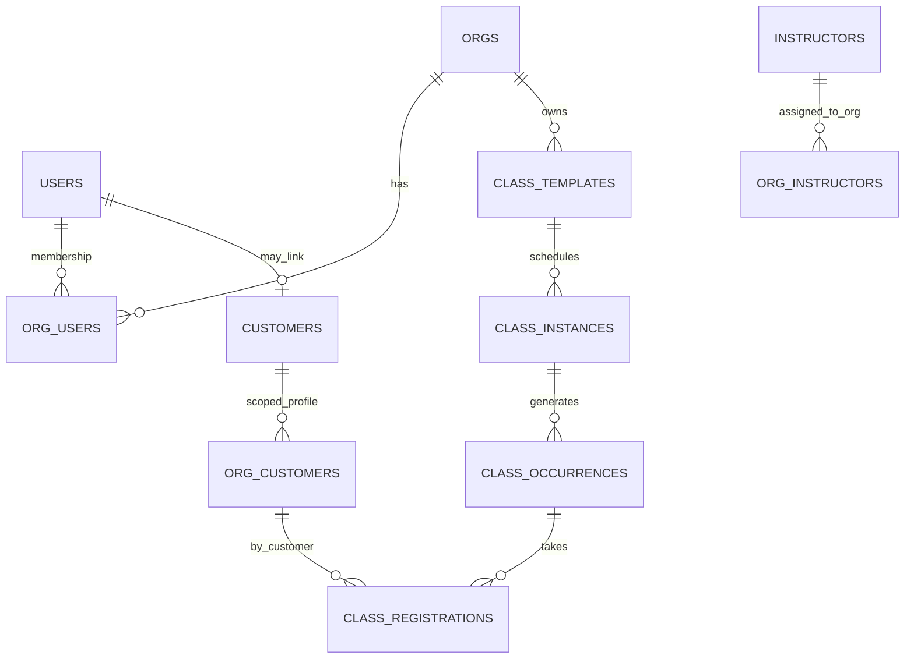
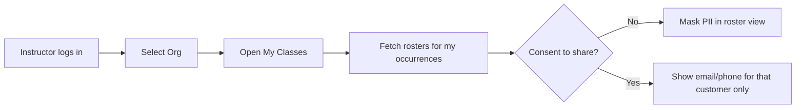

# Onboarding & Multi‑Tenant Access — Full Requirements & Spec

Design for **multi‑org** (studio/brand), **multi‑instructor**, and **privacy‑safe customers**, with streamlined onboarding for **studios**, **instructors** (owner or contractor), and **customers**. Built on Supabase (Postgres, RLS).

---

## 0) Core Principles
- **Single user, many orgs**: one auth account can belong to multiple studios (orgs) with different roles per org.
- **Org boundary = privacy boundary**: customers are **org‑scoped** for PII and marketing consent; cross‑org dedupe uses hashes; no leakage.
- **Least privilege**: instructors see only what they need (their rosters), managers see org data, owners see everything in their org.
- **Explicit consent for sharing**: a customer may opt to share contact with a specific instructor; default is **masked** contact.
- **Immutable audit**: invitations, acceptances, role changes, and consent events are logged.

---

## 1) Actors & Roles
- **Owner** (studio admin) — full control of one org.
- **Manager** — schedule, customers, finance within an org.
- **Instructor (contractor)** — teaches for one or multiple orgs; access limited to their rosters in each org.
- **Front Desk** — check‑in, POS, limited customer view at selected locations.
- **Accountant** — read finance & exports.
- **Marketer** — segments, campaigns (no finance).
- **Customer** — books classes; belongs to many orgs as a client.

> A single **human** can be both **instructor** in Org B and **owner** of their own Org A.

---

## 2) Data Model (key tables)

> All tables include `id uuid`, `org_id`, timestamps. RLS enforces `org_id = auth.org_id()` plus role checks.

### 2.1 Identity & Membership
- **auth.users** — global account.
- **user_profiles** — display slug, locale.
- **orgs** — studio/brand entities.
- **org_users** — membership per org: `{org_id, user_id, role, status}` (role ∈ owner, manager, instructor, front_desk, accountant, marketer). Supports **multiple rows per user** (multi‑org).

### 2.2 Teaching Graph
- **instructors** — profile (bio, photos, payout preferences if owner).
- **org_instructors** — assignment of an instructor to an org and (optionally) to **locations**: `{org_id, instructor_id, role_in_org, locations[]}`.
- **class_templates / class_instances / class_occurrences** — scheduling (as specified elsewhere). Each occurrence has `org_id`, `instructor_id` (primary), `assistant_ids[]`.

### 2.3 Customers & Privacy
- **customers** — *global identity shell* (non‑sensitive): `{user_id?, hashed_email, hashed_phone}` for dedupe across orgs.
- **org_customers** — **org‑scoped PII**: `{org_id, customer_id, first_name, last_name, email, phone, address, marketing_consent{email,sms,push,whatsapp}, consent_log[]}`.
- **org_customer_links** — connection reasons: `{org_id, customer_id, source: 'booking'|'import'|'lead'|'gift_card', first_seen_at}`.
- **masked views** — `v_roster_customers_masked` exposing only minimal fields to contractors (e.g., `first_name`, `last_initial`, **masked_email**: `j***@***.ch`).

### 2.4 Communication & Consent
- **communications** — messages (transactional/marketing) with channel and consent checks.
- **consent_events** — immutable rows for each opt‑in/out with IP, UA, org_id.

---

## 3) Onboarding Journeys

### 3.1 Studio (Org) Onboarding
**Goal:** launch a studio space with legal, payout, brand, schedule, staff.

Steps (wizard with progress save):
1. **Create org** → name, slug, primary locale/timezone, currency (CHF default).
2. **Legal & Compliance** → company address, VAT ID (optional), data processing notice, waiver template.
3. **Payouts** → connect Stripe account (cards/Apple/Google Pay) + Datatrans/Wallee for **TWINT**; bank IBAN for **QR‑bill**.
4. **Branding** → logo, colors, typography, email sender, domain/subdomain (www.studio.ch or studio.yogaswiss.ch).
5. **Locations** → addresses (indoor/outdoor/online), rooms/resources; weather backup plan for outdoor.
6. **Policies** → cancellation, late/no‑show, waitlist, membership pause; tax mode (inclusive/exclusive).
7. **Catalog seed** → at least one class template, one membership/ pass, and optional retail item.
8. **Team** → invite managers, front desk, **instructors** (contractors). Role per user.
9. **Data import** (optional) → customers, passes, schedule from Eversports/Mindbody/etc.
10. **Go‑live checks** → test checkout (CHF 1.00), invoice PDF + QR‑bill render, calendar feeds, email deliverability.

Artifacts:
- `org_users` rows created; invites emailed.
- Webhooks enabled; payout test verified.

### 3.2 Instructor Onboarding
Two paths:

**A) Instructor as Org Owner (solo brand):**
- Creates **their own org** (as above) → full access & payouts to their bank.
- Adds other org assignments later as contractor (see B).

**B) Instructor as Contractor to an Existing Org:**
- Receives invitation link via email → accepts; `org_users.role='instructor'`.
- Sets profile (bio, headshot), languages, specialties, availability; chooses notification prefs.
- **No payout setup** here (payouts handled by the studio).

Access after acceptance:
- Calendar shows only **their classes** in that org by default (toggle to see public schedule read‑only).
- **Rosters** limited to their occurrences; contact **masked** unless explicit consent or messaging via platform.

### 3.3 Customer Onboarding
- Social/email sign‑up → verifies email → accepts **org‑specific** privacy/waiver on first booking.
- **Per org consent** (email/sms/push/whatsapp). Each booking creates or reactivates `org_customers` for that org.
- Wallet/pass migration on import with confirmation email.

---

## 4) Access & Privacy Model

### 4.1 Access Matrix (per org)

| Area | Owner | Manager | Instructor | Front Desk | Accountant | Marketer |
|---|---|---|---|---|---|---|
| Schedule (all) | RW | RW | R (RW own) | R (today loc) | R | R |
| Rosters | RW | RW | R (own classes only, masked PII) | RW (today loc) | R | R |
| Customers list | RW | RW | **No** (only roster subset) | R (lookup) | R | R (no exports without flag) |
| Exports | RW | RW | No | No | **Finance only** | Campaign exports only |
| Finance | RW | R | No | POS only | R | No |
| Marketing | RW | RW | No | No | No | RW |

**Masked PII default for instructors** (contractors):
- Visible: first name, last initial, booking status, membership type, injuries notes (if customer allowed), emergency flag.
- Hidden: full email, phone, address.  
- **Messaging relay**: send message via platform without exposing email. Customers can opt to **share contact** with a specific instructor (per org + per instructor toggle).

### 4.2 Cross‑Org Behavior
- Same **auth user** can belong to many orgs. Each org sees only its `org_customers` data.
- **Customers are not shared** between orgs. If an instructor owns Org A and teaches at Org B, **customers of Org B are not copied to Org A**.
- **Dedupe**: on import/booking, compute `hashed_email`/`hashed_phone` to link global `customers` identity; do **not** reveal cross‑org links.
- **Consent is per org**; unsubscribing from Org B doesn’t alter Org A.

### 4.3 RLS/Views Sketch

```sql
-- Roster: instructors see only their occurrences for the current org
CREATE VIEW v_rosters AS
SELECT r.id, r.class_occurrence_id, r.customer_id, r.status, r.created_at
FROM class_registrations r
JOIN class_occurrences o ON o.id = r.class_occurrence_id
WHERE o.org_id = auth.org_id();

-- Masked customer view for instructors
CREATE VIEW v_roster_customers_masked AS
SELECT oc.org_id, oc.customer_id,
       c.first_name,
       substr(c.last_name,1,1) || '.' AS last_initial,
       CASE WHEN consent.share_with_instructor THEN oc.email ELSE '***@***' END AS email_masked,
       oc.notes_for_instructor
FROM org_customers oc
JOIN customers c ON c.id = oc.customer_id;
```

Policies (conceptual):
- `org_customers`: SELECT only for owners/managers/front_desk; **instructors SELECT via masked view joined to their rosters**.
- `class_registrations`: instructors can SELECT where `class_occurrence.instructor_id = auth.user_id()` (or in assistants).

---

## 5) Invitations & Org Switching

- **Invite flow**: owner/manager enters email + role → system sends invitation token; on accept, create `org_users` row.
- **Pending invites** expiry (7–14 days), resend, revoke.
- **Org switcher** in UI header; remembers last context per device.
- **Single sign‑on** session across orgs; role and RLS context changes on switch.

---

## 6) Catalog & Scheduling During Onboarding

- Studio must create **minimum viable catalog**: 1 class template; set default pricing & capacity; choose waitlist policy.
- Instructor as contractor is **assignable** to templates/instances after acceptance.
- Outdoor setup: define **meeting point** and **weather policy** (+ backup location).

---

## 7) Customer Sharing Scenarios (Do/Don’t)

- **Do** show the **roster** (names, check‑in status) to the instructor teaching that occurrence.
- **Do not** expose the **full customer list** of the studio to contractors.
- **Do** allow **platform messages** from instructor → roster without exposing PII.
- **Do** allow **opt‑in toggle** (“Share my contact with {Instructor} for future updates”). Stores `consent_events` scoped to org+instructor.
- **Do not** copy `org_customers` to another org even if the instructor is owner there.
- **Do** allow studio to **export** customers if role permits; export is watermarked & logged.

---

## 8) Edge Cases

- Instructor leaves an org: disable future class assignments; retain history; revoke access immediately.
- Instructor becomes **owner**: promote role; access expands only within that org.
- Studio merges/splits: migrate `org_id` via migration tool with audit; re‑issue consents if privacy policy changes.
- GDPR/nLPD deletion: deleting a **customer account** triggers org‑scoped deletions/anonymisation; financial docs remain but PII is minimised.
- Corporate bookings: **employer** may see anonymised usage aggregates; employee PII stays at studio unless explicit corporate agreement.

---

## 9) Onboarding Checklists (UI)

### Studio Checklist
- [ ] Legal + VAT + QR‑bill bank
- [ ] Payments (Stripe + TWINT provider)
- [ ] Brand + domain
- [ ] Locations + rooms + outdoor backup
- [ ] Policies (cancel/late/waitlist)
- [ ] Catalog seed (class + price)
- [ ] Team invited (roles set)
- [ ] Test checkout + invoice PDF
- [ ] Import data (optional)
- [ ] Publish public pages

### Instructor (Contractor) Checklist
- [ ] Accept invite
- [ ] Complete profile (bio, skills, photos)
- [ ] Set availability & notifications
- [ ] Review roster access policy
- [ ] First class assignment acknowledged

### Customer Checklist
- [ ] Verify email
- [ ] Accept org waivers/policies
- [ ] Choose comms consent per channel
- [ ] (Optional) share contact with instructor

---

## 10) RPCs & Events

- `create_org(payload)` → org + owner membership.
- `invite_to_org(org_id, email, role)` → invite token.
- `accept_invite(token)` → create `org_users` row.
- `assign_instructor(org_id, instructor_id, locations[])`.
- `link_customer_to_org(org_id, customer_input)` → creates `customers` (if needed) + `org_customers`.
- `set_consent(org_id, customer_id, channel, value, scope?)` — scope can include instructor id.
- `get_roster_masked(org_id, instructor_id, occurrence_id)`.
- `request_data_export(org_id)` / `delete_me()` (GDPR).

Events:
- `org.created`, `org.invited`, `org_user.accepted`, `consent.changed`, `role.changed`.

---

## 11) Quality & Acceptance

- Instructors in contractor role **cannot** list/export full customers; can only access **their rosters** (masked by default).
- Customers booking with a studio are **not** visible to an instructor’s other orgs.
- Consent logs present and **timestamped**; messaging respects consent.
- Invitations/role changes fully audited; revoking access immediately hides org data.
- E2E: create studio → invite instructor → create class → customer books → instructor sees masked roster → customer opts to share → instructor sees full contact for that customer only.

---

## 12) Diagrams

### 12.1 Relationships


### 12.2 Access Flow


---

This spec ensures **clean onboarding** and **safe multi‑tenant access**: instructors can teach across studios, studios can host many instructors, and **customer privacy is preserved** with org‑scoped data and explicit consent for any sharing.
